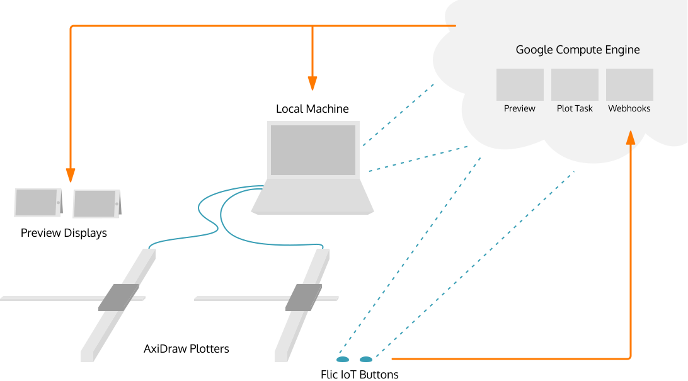
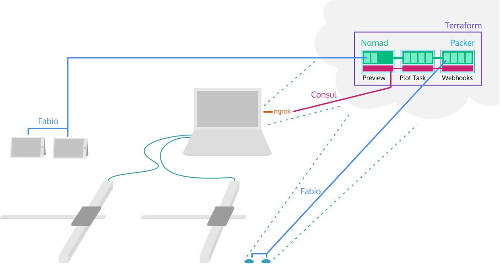

Since this wasn't any generative art project, it was an installation, and it wasn't just any installation, it was for [HashiConf 2019](https://hashiconf.com/us/schedule), I knew infrastructure would have to play a major role.

Of course I had to use HashiCorp products to achieve this.

HashiCorp's product portfolio consists of six tools all geared towards practitioners meant to assist common devops workflows.

1. **Vagrant**: Configure VMs with code and manage them with a CLI tool.
2. **Packer**: Configure and provision machine images for a variety of platforms.
3. **Terraform**: Declare all your cloud resources as code and fearlessly change everything with a plan/apply workflow.
4. **Vault**: Centralize all things security, including general secrets as well as both human and machine identity.
5. **Consul**: Secure service discovery and networking and a lightweight distributed key/value store.
6. **Nomad**: Orchestrate any workload, automate software deployments, and execute batch tasks across your fleet of servers.

Of this suite of tools, this installation used four. I love Vagrant, but since all of the code I wrote was both greenfield and lightweight, I got by with just Docker. I planned on incorporating Vault, but instead I ran out of time.

## High-level Architecture

Before digging into the details, I think it's important to present what the architecture ultimately ended up being. I think this is important for a couple reasons. First, it can be really hard to see the forest from the trees when talking about cloud architecture. Second, this design is completely excessive for what I built, so it would be easy to doubletake and reject what I'm saying in order to feel better about the choices I made.



The flow of operations here goes something like

1. Press an IoT button.
2. IoT button sends a request to a webhooks service.
3. The webhooks service routes the request either to the local axidraw service or the plot service.
4. The axidraw service will handle requests by changing the state of the plotter state machine.
5. The plot service will handle requests by generating another plot and queueing it for the plotter.
6. The axidraw service will dequeue the next plot and plot it when ready.
7. When the axidraw plotter has finished a plot, it will transition into a finished state.
8. A human will manually swap out paper and maybe the plotter pen.
9. A human will press the IoT button signalling that the plotter is ready to dequeue the next plot.

How can this be built using HashiCorp tools?



## Using Nomad to orchestrate services

This installation is comprised of four different microservices: an axidraw service to run the plotter, a webhooks service to receive IoT button requests, a design service that generates art (for svg extraction), and a preview service that presents art (in an animated and screen-optimized way).

Of these services, only one _has_ to run locally, and that's the axidraw service. Why? Because the plotter is a physical thing that needs to be plugged in.

Theoretically, the hard requirement of the axidraw service needing to run locally doesn't mean it can't be run with Nomad. A Nomad agent could be running on the local machine, and the Nomad job for the axidraw service can be configured to constrain the service to only be able to run on the local machine. The tricky part is getting the local machine to join the rest of the Nomad cluster running in the cloud. Nomad makes this type of configuration about as simple as it gets, but it still requires admin access to the local network. Since this was running on spotty WiFi in a hotel, this wasn't a practical option.

So the axidraw service gets to run on its own outside of the Nomad cluster. The other three services all run in the Nomad cluster. This means super simple environment configuration, deployments, and scaling all without having to think too hard about the underlying hardware.

For instance, here's the job definition for the webhooks service:

```hcl
job "webhooks" {
  datacenters = ["dc1"]

  type = "service"

  group "webhooks" {
    count = 1

    constraint {
      distinct_hosts = true
    }

    task "webhooks" {
      driver = "docker"

      config {
        image = "dingoeatingfuzz/h19-webhooks:0.3.11"
        port_map {
          api = 8081
        }
      }

      env {
        CONSUL_HOST = "hashi.plot.technology"
        CONSUL_PORT = "8500"
        NOMAD_HOST  = "http://hashi.plot.technology:4646"
      }

      resources {
        cpu = 500
        memory = 256
        network {
          mbits = 10
          port "api" {}
        }
      }

      service {
        name = "webhooks"
        tags = ["urlprefix-/webhooks strip=/webhooks"]
        port = "api"
        check {
          name = "alive"
          type = "http"
          path = "/"
          interval = "30s"
          timeout = "2s"
        }
      }
    }
  }
}
```

This makes sure that one instance of the webhooks service is always running. When using `nomad run webhooks.hcl` to run the job, Nomad will automatically download the docker image as defined in the `config` block and map the port `8081` in the container to a dynamic port on the host. It also sets up some environment variables that the service in the container uses to read state from Consul and submit Nomad jobs. It also limits the container to 500Mhz of CPU and 256MiB of memory. Lastly, and most importantly, is the `service` block.

The `service` block does two things. The first is register this service in Consul, and the second is tag the service in a manner that fabio will interpret to route traffic to. Nomad may be orchestrating all the workloads, but fabio is balancing and routing external traffic.

All three services running in Nomad look similar. You can [see all the job definitions in the repo](https://github.com/DingoEatingFuzz/h19/tree/master/jobs).

## Using Nomad to queue batch jobs

Nomad is also responsible for running the job that generates SVGs and submits them to the plotter. This type of workload would be awkward to model as a service job. Afterall, these are short lived processes that exit once the SVG is sent.

For this type of job, Nomad has a batch scheduler. Unlike the service scheduler, batch jobs don't have deployments and they are expected to terminate. That said, if a batch job fails (e.g., `exit 1`), it can be configured to retry.

So that solves the batch workload issue, but what about the work queue? Having to submit plot jobs one by one on demand gets tedious. It would be much nicer if plot jobs can come in at whatever pace without requiring human intervention or coordination with the axidraw service.

There is a whole lot of queueing software out there that can achieve a low throughput, small task size, and short task life queue, but nothing else is needed in this case. Nomad has a parameterized job mode that allows queuing instances of a batch job using the `nomad job dispatch` command (or equivalent API). This just schedules another instance of the job, and if there is no more room in the cluster, Nomad holds the job in a queued state until space is made available. In fact Nomad will do this for all jobs, but this parameterized job mode wraps a nice workflow around it.

Between the service jobs and the plot batch jobs, that's all the software that needs to be run. But somehow all the pieces need to talk to each other. Consul is used for this connectivity bit.

## Using Consul to distribute configuration

There are a few problems around networking that need to be solved, one already mentioned. How do services running within the Nomad cluster get exposed to the public internet? How does state get shared among the preview service, and the plot jobs? How does the plot job know what the address of the local axidraw service is? How do the Nomad clients and servers talk to each other at all?

Services get exposed to the public internet via Fabio and Consul, as mentioned. Specifically, when services running in Nomad register themselves with Consul, then they are iterable from anything that has access to the Consul registry. Fabio has this access. Fabio itself is a reverse proxy built for Consul. Unlike a typical reverse proxy with which each service is manually specified in a configuration file, Fabio automatically configures itself using Consul's service registry. Each service can provide its own tweaks to the default configuration using Consul tags. You can see in the above job the `urlprefix` and `strip` tags which tell Fabio to serve this service at `/webhooks` and when receiving requests from the public URL, strip the `/webhooks` path before forwarding the request to the internal webhooks service.

The preview service and the plot job all need to be synchronized. In order to gaurantee a uniform distribution of plots by product, there needs to be a global cycle that the plot jobs respect. In order for the preview service to actually show what is being plotted, the running plot job configuration needs to be shared with the preview service. All of this message passing/synchronization is done using Consul K/V: a distributed key/value store that can be read by any service that has access to Consul's APIs. In this way, the axidraw address can be set in Consul K/V when the services come online, the plot job can read the current product to make a plot for and subsequently update the value to the next product, the plot job can also store the seed used to generate a plot, then the preview service can read the product and seed to construct an identical plot for the tablet displays.

Nomad servers and clients bootstrap using Consul in a similar way to how Fabio constructs a cluster-wide reverse proxy: each Nomad agent registers itself with the local Consul agent and discovers one-another through Consul's service registry.

With all these architectural details ironed out, all that's left to do is spin the whole thing up. Terraform is used for provisioning the hardware this all runs on.

## Using Terraform to provision infrastructure

After Vagrant, Terraform is HashiCorp's most widely used product. An overview seems unnecessary at this point, but it only takes a sentence. Terraform lets you write infrastructure as code which means configurations are version controlled, changes to infrastructure become changes to code, and reconciling how to go from State A to State B is abstracted as a problem for Terraform and not for operators.

Terraform uses HCL as its configuration language, which is intentionally a low-powered language. A complete programming language like python or ruby means losing the declarative safety that allows Terraform to calculate state diffs. A typical configuration language like JSON or YAML means tedious copy/pasting and difficult refactoring at scale. Like any programming language and any framework, HCL and Terraform has their own best practices.

The number one best practice is to identity your variables. What values are most likely to change as your infrastructure grows? The machine image used for certain servers? The count of servers? The size of servers? DNS? Firewall settings? Volume sizes?

The second (in my opinion at least) is to stay organized by using modules. The Terraform configuration I used is modeled after the configuration found in the Nomad repo. I had to change just about all of it to use GCP's idea of how infrastructure is provisioned, and I extended it to also include networking configuration for my specific application of Nomad.

A neat aspect of Google's compute instance groups and Consul and Nomads' automatic bootstrapping is that scaling a cluster up and down can be reduced to single Terraform variable. Changing the count of client nodes and running `terraform apply` will provision more instances of client nodes, the new client nodes will automatically join the Consul and Nomad clusters, and then they will be ready to receive jobs from Nomad. Not quite autoscaling, but it's the next best thing (arguably better if you're afraid of a volatile cloud bill).

```hcl
resource "google_compute_instance_group_manager" "client_group" {
  name = "${var.name}-client-igm"

  base_instance_name = "${var.name}"
  instance_template = "${google_compute_instance_template.client_template.self_link}"
  update_strategy = "NONE"
  zone = var.zone

  target_size = var.client_count
  target_pools = [google_compute_target_pool.clients.self_link]

  named_port {
    name = "http"
    port = var.service_port
  }
}
```

This workflow of edit configuration, plan changes, push code changes, apply changes is made even easier with Terraform Cloud. It's basically Travis/Circle for infrastructure. Pushes are automatically picked up by Terraform Cloud which will immediately perform `terraform plan` for you. Then with a click of a button, a plan can be approved, triggering the `terraform apply`.

This was especially handy when during the event I had to make infrastructure changes. Given how distracted I was trying to run the installation while changing it, I'm sure I would have made a mistake if I had to make infrastructure changes by hand. Since all I had to do was modify a couple variables (first I tried bumping up the node count, then I tried provisioning larger boxes) and push my changes, I managed just fine.

The observed problem was plot jobs failing over half of the time. I didn't know why that was, but when in doubt, make more machines. Typically I would try to assess root cause, but now wasn't the time.

```diff
commit b50f7c7ff17fc9ddd21f3bee9d8c3f03f7d9e732
Author: Michael Lange <dingoeatingfuzz@gmail.com>
Date:   Tue Sep 10 08:59:33 2019 -0700

    More client nodes

diff --git a/infrastructure/terraform/main.tf b/infrastructure/terraform/main.tf
index ed61c9f..7f4b048 100644
--- a/infrastructure/terraform/main.tf
+++ b/infrastructure/terraform/main.tf
@@ -19,7 +19,7 @@ module "hashistack" {
   server_machine_type = "n1-standard-1"
   client_machine_type = "g1-small"
   server_count = 3
-  client_count = 2
+  client_count = 6
   nomad_binary = "https://releases.hashicorp.com/nomad/0.9.0/nomad_0.9.4_linux_amd64.zip"
   root_block_device_size = 16
   client_block_size = 50
```

This didn't fix it, but I also didn't have any better ideas yet. In hindsight, this is embarrassing, but hey, we don't make our best decisions under pressure in high-intensity environments. This is why it's so important to run through disaster scenarios before you're in an actual disaster.

```diff
commit 5f91e1260a74a1ad9fd23e79886dedbacbea79cb
Author: Michael Lange <dingoeatingfuzz@gmail.com>
Date:   Tue Sep 10 09:28:07 2019 -0700

    Even more nodes

diff --git a/infrastructure/terraform/main.tf b/infrastructure/terraform/main.tf
index 7f4b048..542cccd 100644
--- a/infrastructure/terraform/main.tf
+++ b/infrastructure/terraform/main.tf
@@ -19,7 +19,7 @@ module "hashistack" {
   server_machine_type = "n1-standard-1"
   client_machine_type = "g1-small"
   server_count = 3
-  client_count = 6
+  client_count = 12
   nomad_binary = "https://releases.hashicorp.com/nomad/0.9.0/nomad_0.9.4_linux_amd64.zip"
   root_block_device_size = 16
   client_block_size = 50
```

When this didn't work, I took a step back.

Why would the plot jobs be failing? Sure they are running puppeteer to scrape the SVG from the design service, but you'd think they would fail all the time if they didn't actually have enough resources. The other explanation was network connectivity. If puppeteer was failing to request the design service web page, this would cause the job to crash. Since the job worked sometimes, it wasn't a general access issue, it would have to be a bandwidth problem that's causing intermittent timeouts.

I'm not a GCP expert, but I remembered from when I was setting this all up initially that in GCP [outbound bandwidth is a function of the machine type](https://cloud.google.com/compute/docs/machine-types). Since these client nodes are tiny (`g1-small`), maybe making them bigger will open more bandwidth and fix the supposed timeout issues.

```diff
commit f97522e4e3d7fbd035d0ed357fc1252e1e05db88
Author: Michael Lange <dingoeatingfuzz@gmail.com>
Date:   Tue Sep 10 14:26:10 2019 -0700

    beefier client nodes

diff --git a/infrastructure/terraform/main.tf b/infrastructure/terraform/main.tf
index 542cccd..2fc30b4 100644
--- a/infrastructure/terraform/main.tf
+++ b/infrastructure/terraform/main.tf
@@ -17,9 +17,9 @@ module "hashistack" {
   region = "us-west1"
   zone = "us-west1-b"
   server_machine_type = "n1-standard-1"
-  client_machine_type = "g1-small"
+  client_machine_type = "n1-standard-2"
   server_count = 3
-  client_count = 12
+  client_count = 4
   nomad_binary = "https://releases.hashicorp.com/nomad/0.9.0/nomad_0.9.4_linux_amd64.zip"
   root_block_device_size = 16
   client_block_size = 50
```

Was my diagnosis correct? It's impossible to know, but making the machines bigger definitely fixed the problem. If this infrastructure needed to live for longer than two days, I would want to study the problematic behavior. If it was in fact due to outband bandwidth limitations, I would want to think hard about rearchitecting things to use internal networking to request the design service. There's no reason outbound traffic was used other than the convenience of accessing the design service through the public address made available through Fabio.

Either way, I think this little production outage story does a good job showcasing the power of infrastructure as code and a thoughtful continuous delivery tool in the form of Terraform Cloud.

Back to the infrastructure as architected. Terraform explains the servers, the networking, DNS, and such, but what about _configuring_ the servers? How does Consul and Nomad end up on the boxes and what starts them? This is done in an immutable way with Packer.

## Using Packer to build machine images

Configuration management is a problem as old as devops. I wouldn't call Packer a configuration management tool, but it can work as one in the same way that Nomad's parameterized jobs can work as a work queue. You'll probably outgrow it eventually, but it works surprisingly well and prevents introducing more tools and complexity.

With Packer, machine images can be built off of base images and provisioned with all sorts of stuff including shell scripts and general file copying.

For this installation, there is only one machine image type. Two seems like the likely number considering there are server and client machines, but since Consul and Nomad are both one binary that can be ran in either mode, the machine image for the two modes can be identical and started in different ways.

The actual Packer configuration and related scripts are mostly uninteresting, but I think there is beauty in that. A lot is happening under the surface, but it's concealed from the perspective of authoring the image.

```json
{
  "builders": [
    {
      "type": "googlecompute",
      esaccount_file": "../terraform/account.json",
      "source_image": "ubuntu-1804-bionic-v20190722a",
      "ssh_username": "ubuntu",
      "project_id": "hashiconf19",
      "zone": "us-west1-b"
    }
  ],
  "provisioners": [
    {
      "type": "shell",
      "inline": ["sudo mkdir /ops", "sudo chmod 777 /ops"]
    },
    {
      "type": "file",
      "source": "./scripts",
      "destination": "/ops/scripts"
    },
    {
      "type": "file",
      "source": "./config",
      "destination": "/ops/config"
    },
    {
      "type": "shell",
      "script": "./scripts/setup.sh"
    }
  ]
}
```

This is the entire Packer script. A base image, a GCP account to build into, and some provisioners that are mostly copying start up scripts.

Running this with `packer build <file>.json` creates a new image in the GCP account and emits an image ID that then gets saved as a Terraform variable. This way the next time the infrastructure gets created, it uses the new image.

```hcl{15}
module "hashistack" {
  source = "./hashistack"

  name = "art-plotter"
  region = "us-west1"
  zone = "us-west1-b"
  server_machine_type = "n1-standard-1"
  client_machine_type = "n1-standard-2"
  server_count = 3
  client_count = 4
  nomad_binary = "https://releases.hashicorp.com/nomad/0.9.0/nomad_0.9.4_linux_amd64.zip"
  root_block_device_size = 16
  client_block_size = 50
  whitelist_ip = "0.0.0.0/0"
  image = "packer-1567846697"
}
```

Like I said, it's a little heavy-handed to destroy and recreate the world every time a provisioner script is changed, but for a small fleet of servers, this is tolerable. It also guarantees no accidental "pet" servers that end up in irreproducible states.

## Hold on a second

The careful reader may have noticed this post is missing something crucial. Sure the images that come out of Packer may have Nomad and Consul starting at startup, but how do they talk to each other? It seems like this would just result in N servers all running Consul and Nomad independent of each other.

I mentioned earlier that Nomad and Consul can both automatically bootstrap, but I didn't explain how.

Here is what the Consul configuration looks like:

```json
{
  "log_level": "INFO",
  "server": true,
  "ui": true,
  "data_dir": "/opt/consul/data",
  "bind_addr": "0.0.0.0",
  "client_addr": "0.0.0.0",
  "advertise_addr": "IP_ADDRESS",
  "bootstrap_expect": SERVER_COUNT,
  "service": {
    "name": "consul"
  },
  "retry_join": [
    "RETRY_JOIN"
  ],
  "http_config": {
    "response_headers": {
      "Access-Control-Allow-Origin": "*"
    }
  }
}
```

This is invalid JSON because `SERVER_COUNT` and `RETRY_JOIN` are both replaced by dynamically by a script that is invoked at startup. That script is configured and copied by Terraform. Terraform has variables for both of these dynamic bits. `RETRY_JOIN` is used to configure how Consul should automatically bootstrap using a process called [cloud auto-join](https://www.consul.io/docs/agent/cloud-auto-join.html). The process is pretty simple and incredibly convenient. You tell Consul what cloud you're using and what tag all the Consul VMs have in common. Then Consul, using [go-discover](https://github.com/hashicorp/go-discover), will use GCP APIs to find the addresses for all VMs with that tag (in this case `auto-join`). Each of these Consul agents will communicate with one another to establish quorum and get things started.

```hcl
variable "retry_join" {
  type = "map"

  default = {
    provider  = "gce"
    tag_value = "auto-join"
  }
}
```

Nomad also supports cloud auto-join, but since the Consul cluster is already auto-joining, Nomad can instead use Consul to bootstrap. This is all explained better than I could [in the Nomad clustering guide](https://learn.hashicorp.com/nomad/operating-nomad/clustering).

This is the entirety of the Nomad configuration that results in bootstrapping:

```hcl
# Enable the server
server {
  enabled = true
  bootstrap_expect = SERVER_COUNT
}

consul {
  address = "127.0.0.1:8500"
}
```

There's more to bootstrapping than this. Nomad uses a technique similar to both Fabio and cloud auto-join where Nomad servers and clients register themselves in Consul with a specific tag and then use Consul's service registry to find one another. Since Nomad is so frequently deployed alongside Consul, this automatic bootstrapping configuration is the default.

## That's it!

Okay, that's actually a lot. Especially considering that this could all be running on just the laptop with the AxiDraw connected to it, but I wanted to incorporate HashiCorp tools in a realistic manner. Even if I didn't have to do it, all these pieces are independently scalable and distributed. That's the cloud infrastructure dream.

## Where to now

That's how the infrastructure is designed, provisioned, and managed. How about the software running on it? Next, read about the microservices running in the distributed system.
