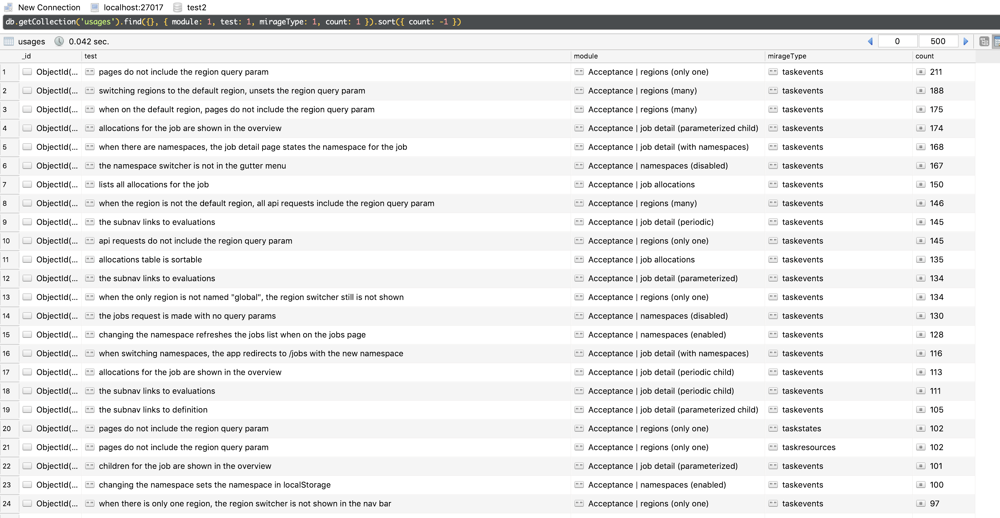

This is the story about how I started off annoyed at my slow test performance and ended up with a new node
package, monkey-patching Mirage, and making a Mongo database. All so I could save a few minutes here and there.

## The Tipping Point

My tests had been slow for awhile now. To begin with, they were pushing five minutes. I knew this was bad and would only get worse, but I shrugged it off. When you consider even building tests for Ember takes a minute and I don't run all the tests at once very often outside of CI, it just didn't seem like a big enough issue.

At this point I was also well aware of performance issues with [Ember CLI Mirage](http://www.ember-cli-mirage.com/).
Mirage is amazing at what it was made for (mocking an API so you can build out UI ahead of API delivery), but in order to solve that developer experience, it accidentally became a hand-rolled database.

Over time my code base grew (as code bases tend to do), and my test suite time ballooned to 10-12 minutes. This is unacceptable considering the scope of the project, but still easy to shrug off and grit through.

That is, until I upgraded Ember. I lean on tests a lot when upgrading dependencies because I want to catch bugs early and I don't want to have to figure out which upgrade introduced unwanted behavior. When tests take 12 minutes to run, the feedback loop was painful enough for me to sit down and do something about it.

## The Plan

I had a three step plan

1. Learn more about which tests are slow
2. Dig into my Mirage usage
3. Work through low-hanging fruit

In hindsight, there's an amusing amount of irony that the end goal was "low-hanging fruit" while steps one and two were each adventures in their own right.

As projects often go, I didn't know that at the time.

## Learning more about which tests were slow

Ember uses Testem as the test runner, which by default prints out a lot of useful information, including browser used, test duration, test module, and test name. This is everything I needed to do some light analysis.

I could have parsed `stdout` to get all the information I needed, but that would have been starting from square 1 when I could instead start from square 10. Testem allows you to configure reporters, one of which is the TAP reporter. TAP, [the Test Anything Protocol](https://testanything.org/), is a standardized test output format that allows for piping into different reporters and aggregators. One pre-existing reporter is [`tap-json`](https://www.npmjs.com/package/tap-json), which takes test output and converts it into JSON that includes each test by name, whether or not it passed, and a bunch of other stuff. This is good since I would have almost definitely naively split `stdout` on line breaks and spun my wheels once I realized that there were also warnings, test failures, and summary lines to worry about.

One thing that is not a part of TAP is test module and duration, which was the exact information I wanted. These values were both in the test name though, which is much easier to mess with than the entire test output.

```js
// Parsing the Ember QUnit test name output

// Chrome 73.0 - [2 ms] - Unit | Util | formatDuration: When all units have values, all units are displayed
const matches = name.match(/^(.+?)\s-\s\[(\d+) ms\] - (.+?): (.+)$/);
if (matches) {
  const [, browser, duration, module, test] = matches;
  // browser: 'Chrome 73.0'
  // duration: 2
  // module: 'Unit | Util formatDuration'
  // test: 'When all units have values, all units are displayed
}
```

Please don't judge my regular expression. It works, okay?

Now that I had a structured set of all tests, their modules, and their durations, I could compute some summaries. I wanted to know which tests were slowest, so I could fix them one-by-one, as well as which modules were slowest on average, which indicates an expensive `before` hook.

After a couple hours of twiddling, re-learning Node APIs,  going overboard with [chalk](https://github.com/chalk/chalk), and expanding the scope to average durations across multiple test runs, I was able to take a standard `ember test` output and get a summary that looked like this:


Tests will be red, yellow, or green depending on how long they take. Unfortunately, all the top offenders in my test suite are firmly in the red category.

After finishing my three step plan, I returned to this script, cleaned it up a bit, and published it as [Ember Test Audit](https://github.com/DingoEatingFuzz/ember-test-audit).

## Dig Into Mirage Use

As mentioned earlier, Mirage doesn't scale well. Specifically, creating records in mirage is roughly `O(n log n)` for records of the same type.

What does this mean? If I want my tests to run faster, I need to avoid creating a lot of a single resource type in a test. Especially if those resources aren't being used.

The way I am using Mirage may be a little unconventional. [Nomad](https://www.nomadproject.io/) only has a few high-level object types from which all the other objects derive. Rarely do I create an [Allocation](https://www.nomadproject.io/api/allocations.html). I instead create a [Job](https://www.nomadproject.io/intro/getting-started/jobs.html), which creates a TaskGroup, which creates Allocations. This makes it really hard to get a sense of what I'm making and really easy to accidentally make hundreds of records.

At EmberConf, Sam Selikoff tought me a Mirage trick that has come in handy: you can dump the entire Mirage database with `server.db.dump()`. This is great for me since it gives me that sense of db size that I was missing. However, each test is configured slightly differently, so calling dump once isn't useful. I need to call this for every test.

I did this with two tricks, one more awful than the other.

### Getting a Mirage DB Dump for Every Test

First, we need to actually dump on every test. With hooks, this is really easy to patch in. Fair warning: I'm about to talk about editing `node_modules` directly. If this makes you anxious, please take a deep breath, remind yourself that this is just for some one-off debugging, this doesn't impact typical developer workflow or even worse, production.

Still with me? From the root of your app you can do something like `vim node_modules/ember-cli-mirage/addon-test-support/setup-mirage.js` and make this following change.

```js{5-10}
// ...
hooks.afterEach(function() {
  return settled().then(() => {
    if (this.server) {
      window.__mirage_audit = window.__mirage_audit || [];
      window.__mirage_audit.push({
        test: window.currentTest.name,
        module: window.currentTest.module,
        dump: this.server.db.dump(),
      });
      this.server.shutdown();
      delete this.server;
    }
  });
});
```

This will append a DB dump to a globally accessible `__mirage_audit` array with a test name and module name. The one catch is that `window.currentTest` isn't defined yet.

We can define `window.currentTest` in a less gross way. Ember generates a `tests/test-helper.js` file for you that's responsible for creating the application instance and starting the test suite. We can add a QUnit hook in here as well:

```js{6,10-12}
// test-helper.js
import Application from '../app';
import config from '../config/environment';
import { setApplication } from '@ember/test-helpers';
import { start } from 'ember-qunit';
import QUnit from 'qunit';

setApplication(Application.create(config.APP));

QUnit.testStart(test => {
  window.currentTest = test;
});

start();
```

[QUnit](https://qunitjs.com/) exposes a variety of event handlers for doing things like this. [`ember-qunit`](https://github.com/emberjs/ember-qunit) handles it all for you, but if you want to shoehorn in a mirage audit, it's handy to know these things.

### Dealing with the Mirage DB Dump

Now, after all tests run in the browser, the `window.__mirage_audit` array will contain all the DB dumps. This can be **a lot** of data.

In the Chrome console you can quickly get this on your clipboard by using the secret global `copy` helper.

```js
> copy(window.__mirage_audit)
```

At this point you can script with this however you want, but it's a big thing of data and I like something kind of repl-y and visual. At first I went down the route of using [BigQuery](https://cloud.google.com/bigquery/) with [ndjson](http://ndjson.org/), but it was a deadend due to the deeply nested nature of the data.

Instead, I made a local Mongo database and wrote some scripts for scrubbing the data (JS allows for a lot weirder object keys than Mongo does) and inserting it.

Here's the script for taking the raw dump and turning it into ndjson:

```js
const fs = require('fs');
const { EOL } = require('os');

// Read the analysis array off of disk
const src = fs.readFileSync('./mirage-analysis.json');
const json = JSON.parse(src);
const lines = [];

// Make sure object keys are suitable for mongo
const sanitize = obj => {
  if (obj instanceof Array) return obj.map(v => sanitize(v));
  if (obj instanceof Object) {
    const newObj = {};
    Object.keys(obj).forEach(key => {
      let newKey = key
        .replace(/-/g, '_')
        .replace(/\./g, '__')
        .replace(/[^a-zA-Z0-9_]+/g, '');
      if (newKey[0] === newKey[0].toUpperCase()) newKey = '_' + newKey;
      newKey = newKey.toLowerCase();
      const newValue = sanitize(obj[key]);
      newObj[newKey] = newValue;
    });
    return newObj;
  }
  return obj;
};

// Sanitize each test object
json.forEach(row => lines.push(JSON.stringify(sanitize(row))));

// Write it back to disk, this time new-line delimited instead of a JS array
fs.writeFileSync('./mirage-analysis.ndjson', lines.join(EOL));

console.log('Done.');
```

And the follow up script that loads it all into Mongo. The only reason these are two scripts is I thought I was gonna use BigQuery, and after that was a bust I couldn't be bothered to combine the two.

```js
const fs = require('fs');
const { EOL } = require('os');

// Use Mongoose as a db adapter
const m = require('mongoose');
m.connect('mongodb://localhost:27017/test', { useNewUrlParser: true });

// Model each test as a document
var Test = m.model('Test', { test: 'string', module: 'string', dump: 'object' });
var records = fs.readFileSync('./mirage-analysis.ndjson').toString().split(EOL).map(JSON.parse);

Test.insertMany(records, function(err) {
  if (err) console.log('[Test] Uh oh...', err)
  else console.log('[Test] Success!');
});

// Model each mirage usage as a more relational record
var Usage = m.model(
  'Usage',
  { test: 'string', module: 'string', mirageType: 'string', count: 'number', records: 'array' }
);
var usages = [];
records.forEach(r => {
  var types = Object.keys(r.dump);
  types.forEach(t => {
    usages.push({
      test: r.test,
      module: r.module,
      mirageType: t,
      count: r.dump[t].length,
      records: r.dump[t],
    });
  });
});

Usage.insertMany(usages, function(err) {
  if (err) console.log('[Usage] Uh oh...', err)
  else console.log('[Usage] Success!');
});
```

There are a couple interesting things going on here. The first is the model `Test`, which treats each test as a document and stuffs it into Mongo so it can be queried from that [visual repl-y GUI I so desire](https://robomongo.org/).

That wasn't good enough, since doing aggregations and sorting with Mongo is a bigger hassle than I wanted it to be. So I then made the `Usage` model, which treats each mirage model type as the interesting bit, with the test and module being properties. This allowed for sorting by the count of each type by test really easily. And this was the analysis I wanted, since creating too many Mirage records of a single data type in a single test is where the performance issue is.

I know very little about Mongo, but a lot of determination and about 100 browser tabs later, I had this:


959 `taskevent` instances in one test!! Furthermore, there were 73 tests that were creating over 100 `taskevent` instances. That's some enticing low-hanging fruit.

## Working Through the Low-hanging Fruit

Now I have some leads, time to get to business! It's clear looking at that screenshot that there are some usual suspects in the module column. Some job detail modules, namespaces, and regions.

But before looking at these module by module, I wanted to see if there was an opportunity to cut `taskevent` totals across the board.

These `taskevent`s are created in the `afterCreate` of `taskstate`, which is in the `afterCreate` of `allocation`, which is in the &hellip;

So I made a couple changes to the factory.

### Broad changes

```diff
diff --git a/ui/mirage/factories/job.js b/ui/mirage/factories/job.js
index 5afae688b..188490ffc 100644
--- a/ui/mirage/factories/job.js
+++ b/ui/mirage/factories/job.js
@@ -15,7 +15,7 @@ export default Factory.extend({
     return this.id;
   },

-  groupsCount: () => faker.random.number({ min: 1, max: 5 }),
+  groupsCount: () => faker.random.number({ min: 1, max: 3 }),

   region: () => 'global',
   type: faker.list.random(...JOB_TYPES),
@@ -27,7 +27,7 @@ export default Factory.extend({
     faker.list.random(...DATACENTERS)
   ),

-  childrenCount: () => faker.random.number({ min: 1, max: 5 }),
+  childrenCount: () => faker.random.number({ min: 1, max: 3 }),

   periodic: trait({
     type: 'batch',
@@ -137,7 +137,7 @@ export default Factory.extend({
     });

     if (!job.noDeployments) {
-      Array(faker.random.number({ min: 1, max: 10 }))
+      Array(faker.random.number({ min: 1, max: 3 }))
         .fill(null)
         .map((_, index) => {
           return server.create('job-version', {
diff --git a/ui/mirage/factories/task-state.js b/ui/mirage/factories/task-state.js
index 6f1173ff1..ff844807f 100644
--- a/ui/mirage/factories/task-state.js
+++ b/ui/mirage/factories/task-state.js
@@ -17,7 +17,7 @@ export default Factory.extend({
   afterCreate(state, server) {
     const props = [
       'task-event',
-      faker.random.number({ min: 1, max: 10 }),
+      faker.random.number({ min: 1, max: 3 }),
       {
         taskStateId: state.id,
       },
```

Simply making less of stuff is a great easy win. Time to run the analysis again.



Check that out. Huge improvements in object count just like that. 211 is still unacceptable though. Frankly, there's no reason any test needs 100 or more of these. I wrote those tests, I know they are going unlooked at.

### Doing Less in the Regions Tests

These tests were originally written before I added the `createAllocations` and `noDeployments` properties to the `job` factory. We haven't talked about [Deployments](https://www.nomadproject.io/api/deployments.html) yet, but for purpose of the test suite, you can think of them just like allocations. In other words, related data that we usually don't need to create.

```diff
diff --git a/ui/tests/acceptance/regions-test.js b/ui/tests/acceptance/regions-test.js
index 6c1e1715c..c8b54c90e 100644
--- a/ui/tests/acceptance/regions-test.js
+++ b/ui/tests/acceptance/regions-test.js
@@ -15,7 +15,7 @@ module('Acceptance | regions (only one)', function(hooks) {
   hooks.beforeEach(function() {
     server.create('agent');
     server.create('node');
-    server.createList('job', 5);
+    server.createList('job', 2, { createAllocations: false, noDeployments: true });
   });

   test('when there is only one region, the region switcher is not shown in the nav bar', async function(assert) {
@@ -68,7 +68,8 @@ module('Acceptance | regions (many)', function(hooks) {
   hooks.beforeEach(function() {
     server.create('agent');
     server.create('node');
-    server.createList('job', 5);
+    server.createList('job', 2, { createAllocations: false, noDeployments: true });
+    server.create('allocation');
     server.create('region', { id: 'global' });
     server.create('region', { id: 'region-2' });
   });
```

These tests aren't looking at allocations, deployments, or any of the other record types that come along with them. So might as well not make them. Also note that these tests are now only making two jobs. Five is a nice round number, but gotta trim the fat.

### Doing Less in the Namespaces Tests

```diff
diff --git a/ui/tests/acceptance/namespaces-test.js b/ui/tests/acceptance/namespaces-test.js
index b8750fb65..ef132e922 100644
--- a/ui/tests/acceptance/namespaces-test.js
+++ b/ui/tests/acceptance/namespaces-test.js
@@ -11,7 +11,7 @@ module('Acceptance | namespaces (disabled)', function(hooks) {
   hooks.beforeEach(function() {
     server.create('agent');
     server.create('node');
-    server.createList('job', 5);
+    server.createList('job', 5, { createAllocations: false });
   });

   test('the namespace switcher is not in the gutter menu', async function(assert) {
```

Same story here.

### Doing Less in the Job Detail Tests

This one was trickier. Naturally the job detal tests need to have a lot of details about jobs, which includes things like allocations. I can't simply not create allocations, but I still don't want to create task events.

Maybe this is terrible, but I ended up adding a new property to the job factory called `shallow`. When true, `shallow` prevents creating resources beyond task groups and allocations.

```diff
diff --git a/ui/tests/acceptance/job-detail-test.js b/ui/tests/acceptance/job-detail-test.js
index b9c1c6ac8..9ed22aaa0 100644
--- a/ui/tests/acceptance/job-detail-test.js
+++ b/ui/tests/acceptance/job-detail-test.js
@@ -8,26 +8,26 @@ import JobDetail from 'nomad-ui/tests/pages/jobs/detail';
 import JobsList from 'nomad-ui/tests/pages/jobs/list';

 moduleForJob('Acceptance | job detail (batch)', 'allocations', () =>
-  server.create('job', { type: 'batch' })
+  server.create('job', { type: 'batch', shallow: true })
 );
 moduleForJob('Acceptance | job detail (system)', 'allocations', () =>
-  server.create('job', { type: 'system' })
+  server.create('job', { type: 'system', shallow: true })
 );
 moduleForJob('Acceptance | job detail (periodic)', 'children', () =>
-  server.create('job', 'periodic')
+  server.create('job', 'periodic', { shallow: true })
 );

 moduleForJob('Acceptance | job detail (parameterized)', 'children', () =>
-  server.create('job', 'parameterized')
+  server.create('job', 'parameterized', { shallow: true })
 );

 moduleForJob('Acceptance | job detail (periodic child)', 'allocations', () => {
-  const parent = server.create('job', 'periodic');
+  const parent = server.create('job', 'periodic', { childrenCount: 1, shallow: true });
   return server.db.jobs.where({ parentId: parent.id })[0];
 });

 moduleForJob('Acceptance | job detail (parameterized child)', 'allocations', () => {
-  const parent = server.create('job', 'parameterized');
+  const parent = server.create('job', 'parameterized', { childrenCount: 1, shallow: true });
   return server.db.jobs.where({ parentId: parent.id })[0];
 });
```

Now test authors can still think only in terms of jobs when populating the Mirage database but not accidentally end up with a bunch of baggage they aren't going to use.

### Drumroll please...


The average test suite time went down from **12 minutes 5 seconds** to **3 minutes 45 seconds**, or roughly one third of the time. And all in a [`8 files changed, 94 insertions(+), 64 deletions(-)` diff](https://github.com/hashicorp/nomad/pull/5558). Just don't tell anyone about all the behinds the scenes work 🙈

### Takeaways

  1. When getting clever with Mirage, make sure to avoid accidentally creating an excessive number of records through multiplicative consequences.
  2. Doing these types of deep-dives take surprisingly little work. Modifying the test runner, collecting data, setting up a mongodb, and doing analysis sounds like a lot on paper, but in practice it was less than 100 lines of quick code and a couple million browser tabs. If you have ever wanted to do this but held back because it seemed like a bottomless rabbit hole, I encourage you to take the leap sometimes!

